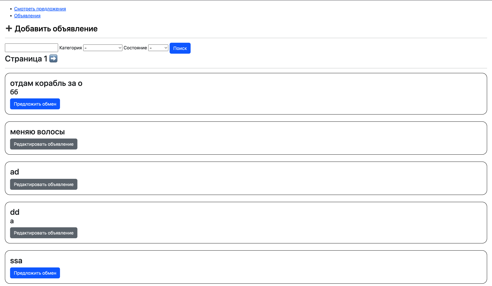
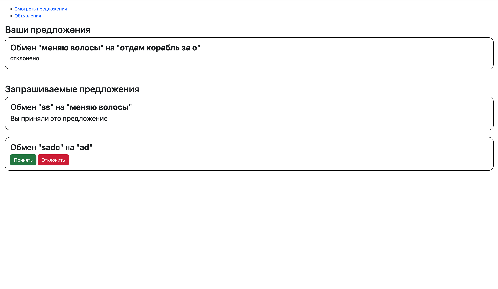

# AdsCRM

## Установка и запуск

1. `git clone <url>`

2. `pip install -r requirements.txt`

3. `python3 manage.py runserver`

## Документация по использованию

### Users
- `/users/register/ ['GET', 'POST']`  - регистрация

- `/users/login/ ['GET', 'POST']` - авторизация (происходит автоматически после регистрации)

### Ads

- `/ads/get_ads/<page_n>/?key_word= &category= condition= ['GET']` - получение всех объявлений с пагинацией (по 10шт на странице) и фильтрация по ключевым словам, категориям и состоянию

- `/ads/create_ad/ ['GET', 'POST']` - создание объявления

- `/ads/edit_ad/<ad_id>/ ['GET', 'POST']` - редактирование объявления

- `/ads/delete_ad/<ad_id>/ ['DELETE']` - удаление объявления

### Proposals

- `/ads/get_props/?sender= &receiver= &status= ['GET']` - получение предложений с фильтрацией по отправителю, получателю, статусу

- `/ads/create_prop/<ad_r_id>/ ['GET', 'POST']` - создание предложения (ad_r_id - id объявления-получателя предложения)

-  `/ads/accept_prop/<prop_id>/ ['PUT']` - принятие (подтверждение) предложения

- `/ads/reject_prop/<prop_id>/ ['PUT']` - отклонение предложения